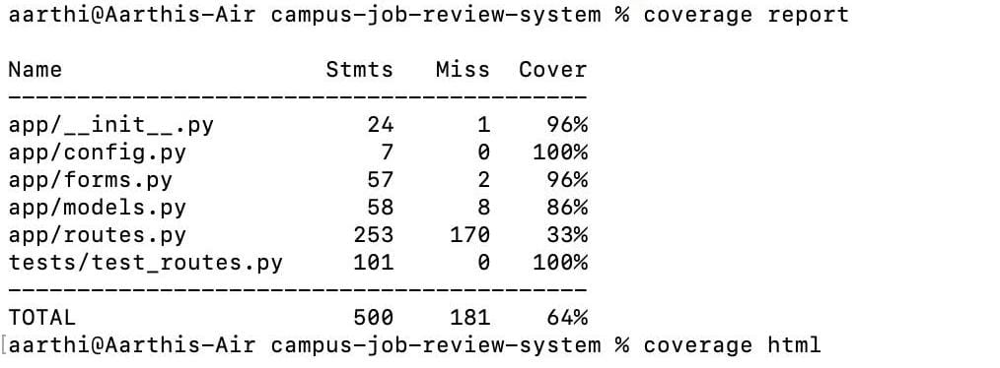

 # Campus Job Review System
 
<!--  -->

<!--  -->

[
)](https://github.com/
/releases)

The Campus Job Review System is a Flask App which has a SQL database for storage. It is created using Python.This website allows NCSU students to read reviews of any job that is open on campus. The portal's objective is to assist students in better comprehending the job description and the work through the experiences of their fellow students. Students can post reviews on the website for others to read. The pupils' anonymity is preserved so they can submit candid evaluations. Furthermore, the website offers user account management, allowing users to store their Resume and contact details. Only that specific user can modify these details after logging in (using the Account Page).

 

## Pre-requisites
To execute these scripts, your computer must have Python installed. For the latest Python version, please visit [Python Installers](https://www.python.org/downloads/). You can use requirements.txt to install other requirements in addition to that. The requirements.txt file has been updated in light of the advancements made.

## Installation
Initially you can check whether your system has python pre-installed or not, usually nowadays in most of the systems, be it Windows or MacOS, python is pre-installed. 

To check whether you have python installed or not, you can open CMD or a Terminal and run the command "python --version". If the CMD shows the version such as Python 3.6.7 then your system already has python installed and you just need to clone the repository and run the python scripts. 

If this is not the case, then you need to download python installer package from [Python Installers](https://www.python.org/downloads/) based on your system's operating system and install it and you can further clone this repository to execute the scripts.

You can refer [Install.md](https://github.com/Fall-2024-SE-Group/campus-job-review-system/blob/main/install.md) for the complete installation steps based on your OS.

## Demo Video
https://user-images.githubusercontent.com/50794731/205819285-9d4875ed-172e-427c-9c0c-591957081a78.mp4

## Poster for Stage 1

## Contribution Code of Conduct

The rules listed below are to be followed by the ones who will be contributing to the code in the repository:
  1)Follow the code quality standards  
  2)Testing: For every new feature or bug fix, write unit tests to ensure code correctness. 
  Ensure existing tests pass: Run all tests before submitting a pull request (PR) to ensure no existing functionality is broken. 
  Follow test coverage requirements: Aim to meet or exceed the project’s test coverage targets. 
  3)Keep commits small and relevant to a single task or fix. Write clear commit messages (e.g., "Fix issue with X" or "Add feature Y"). 
  4)Use Markdown: Follow any guidelines for Markdown formatting and structuring of documentation files (e.g., README.md, CONTRIBUTING.md). 
  5) Branches: Use separate branches when and where needed. 
  6)Handle sensitive information carefully: Avoid hardcoding sensitive information, such as API keys or passwords. Use environment variables or secure configuration files.  
    Follow secure coding practices: Be mindful of security implications in your code (e.g., SQL injection, cross-site scripting).
  

### Code Coverage Screenshot

### Chat Channel Screenshot

## Deployment
We have deployed our website [here](http://44.204.178.112:5000/)

## Contributors

- [Surabhi Nair](https://github.com/surabhi1914)
- [Aarthi Hasitha Yepuri](https://github.com/Hasitha257)
- [Sreeja Nukarapu](https://github.com/Sreeja-Nukarapu)

